# Career Compass Pro - 用户操作流程图

## 概述

本文档描述了Career Compass Pro平台的核心用户操作流程，涵盖从用户注册到完成职业规划的完整用户旅程。

## 主要用户流程

### 1. 用户注册与认证流程

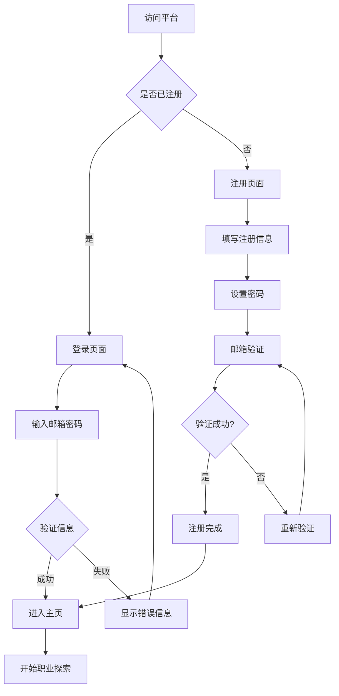

### 2. AI垂直领域定位流程

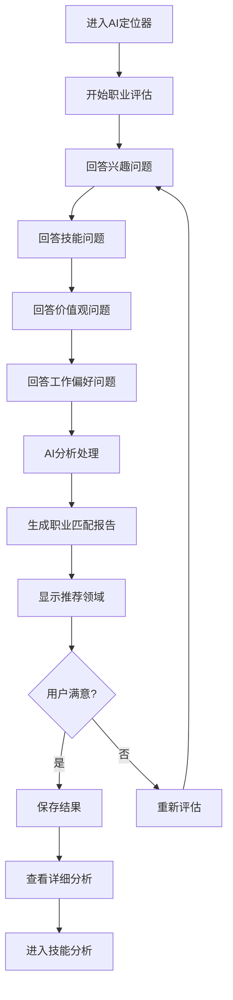

### 3. 动态技能热力图流程

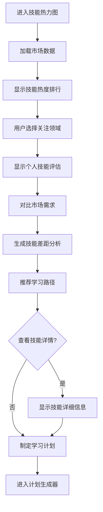

### 4. 90天原子化计划生成流程

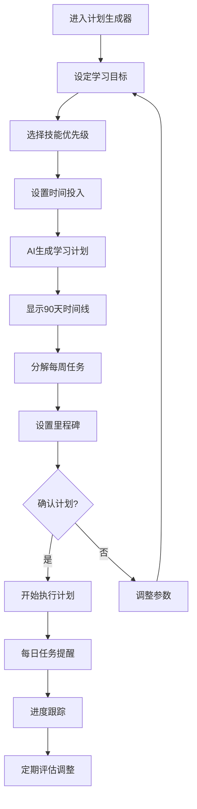

### 5. 实时职位解构引擎流程

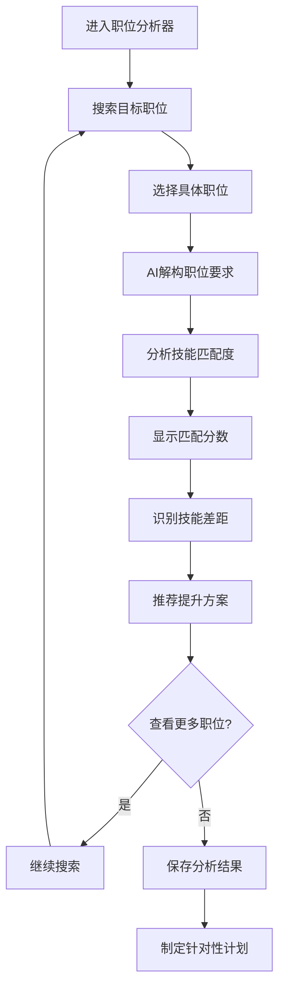

### 6. 风险收益计算器流程

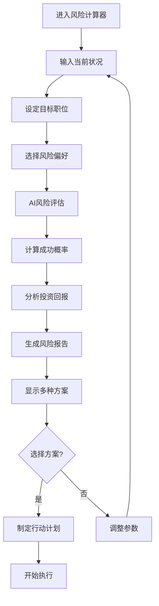

## 核心用户旅程

### 新用户完整旅程

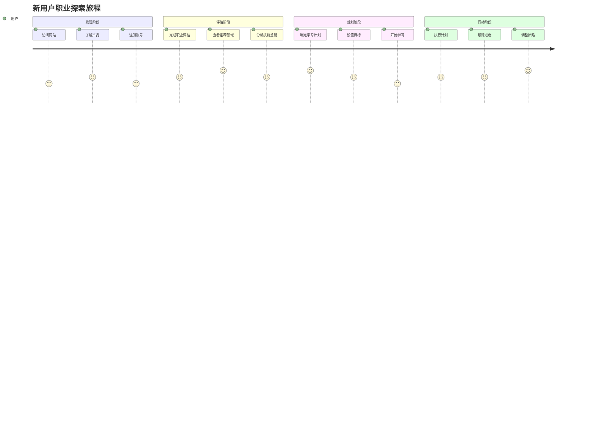

### 回访用户旅程

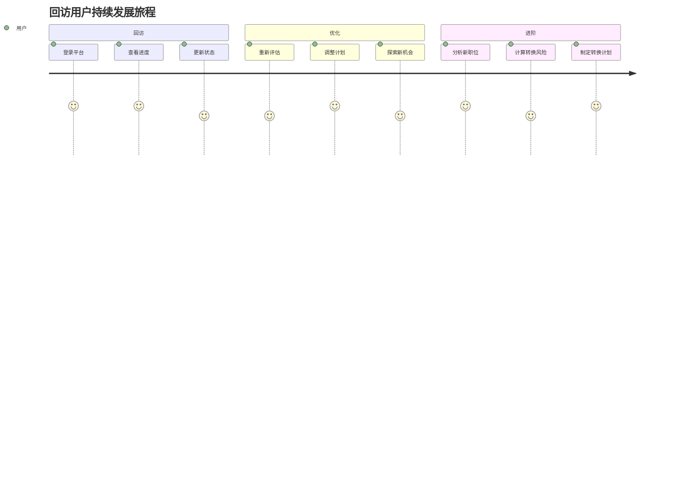

## 页面间导航流程

### 主要页面关系图

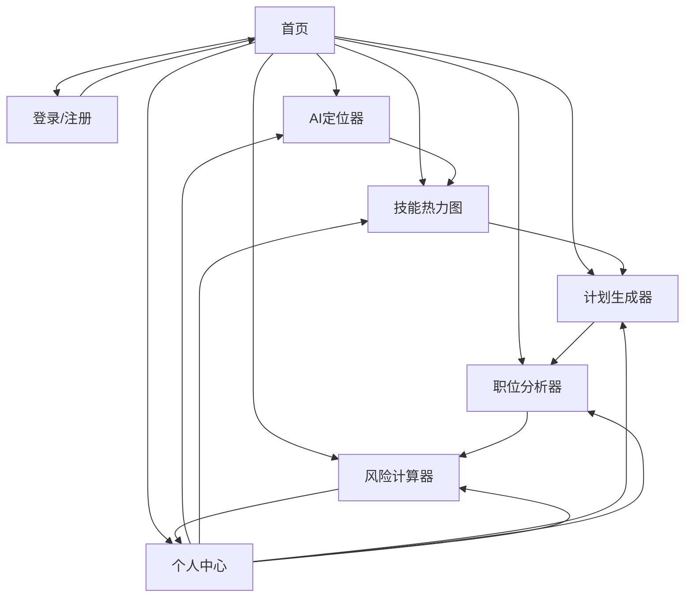

## 关键决策点

### 1. 职业方向选择
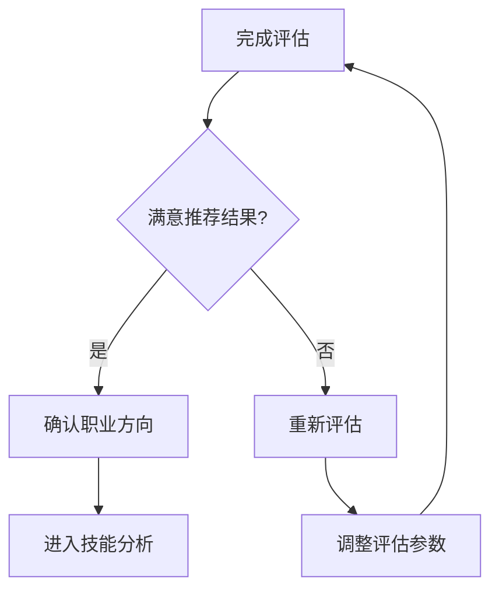

### 2. 学习计划确认
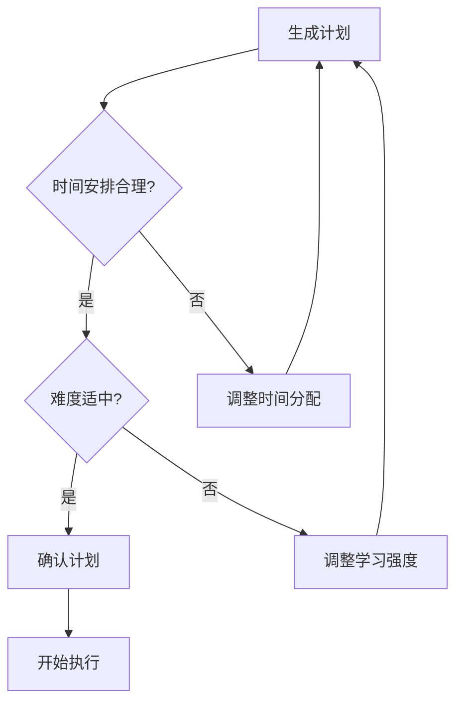

### 3. 职业转换决策
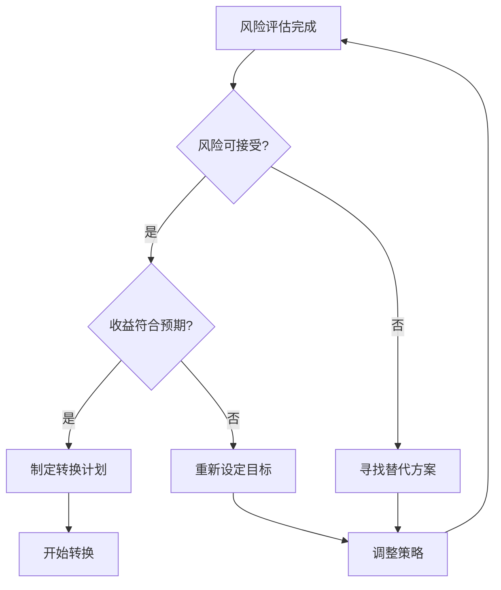

## 异常处理流程

### 1. 评估失败处理
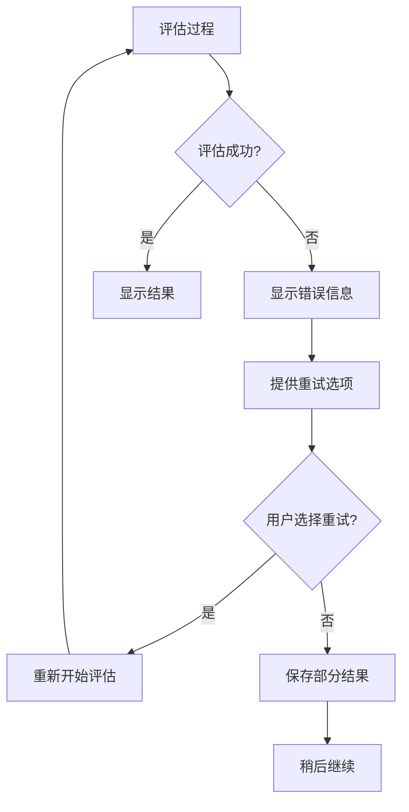

### 2. 数据加载失败
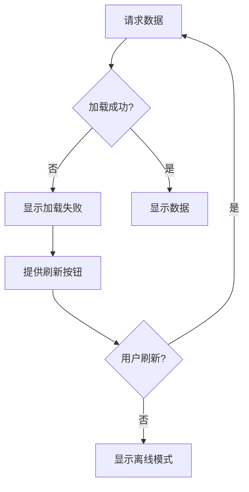

## 性能优化流程

### 1. 页面加载优化
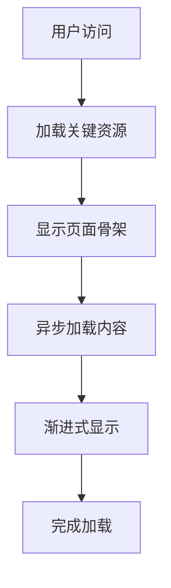

### 2. 数据缓存策略
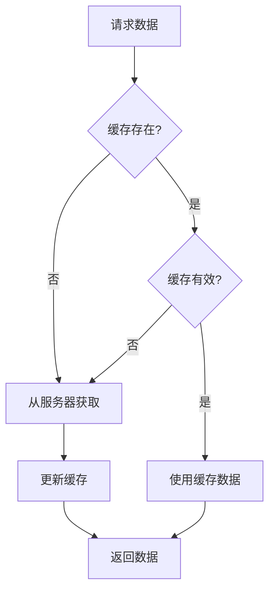

## 用户反馈循环

### 持续改进流程
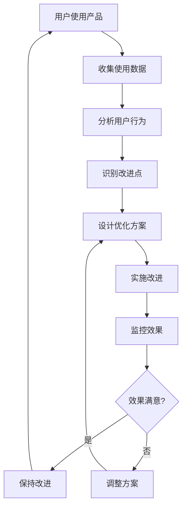

---

**文档版本**: 1.0  
**最后更新**: 2024年12月  
**维护者**: 产品设计团队