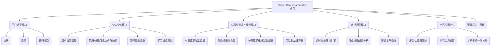
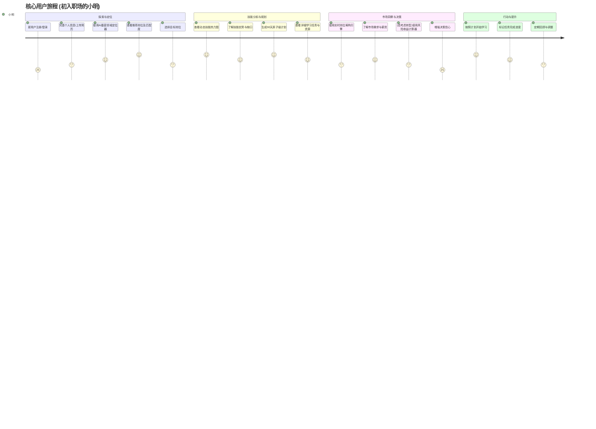

# 产品需求文档 (PRD): Career Compass Pro

## 1. 文档信息

### 1.1 版本历史

| 版本 | 日期       | 作者 | 变更说明         |
|------|------------|------|------------------|
| 0.1  | 2024-07-29 | AI助手 | 初稿，基于用户输入创建 |

### 1.2 文档目的

本文档旨在明确定义 Career Compass Pro Web应用的产品需求，作为产品设计、开发、测试和运营的核心依据。它将详细描述产品的功能、目标用户、市场定位、核心价值以及非功能性需求，确保项目团队对产品有统一和清晰的理解。

### 1.3 相关文档引用

*   [产品路线图 (Roadmap)](./Roadmap.md)
*   [用户故事地图 (User Story Map)](./User_Story_Map.md)
*   [产品评估指标框架 (Metrics Framework)](./Metrics_Framework.md)

## 2. 产品概述

### 2.1 产品名称与定位

*   **产品名称**: Career Compass Pro
*   **产品定位**: 一款基于深度AI分析和垂直领域洞察的职业测评与规划系统，致力于为用户提供精准的职业定位、个性化的技能提升路径和实时的市场趋势分析，帮助用户在职业生涯中做出更明智的决策，实现职业价值最大化。

### 2.2 产品愿景与使命

*   **产品愿景**: 成为最受信赖的智能化职业发展导航者，赋能每一位用户清晰规划职业未来，自信迈向成功。
*   **产品使命**: 通过先进的AI技术和精准的数据洞察，解决用户在职业发展中遇到的方向模糊、技能差距、学习路径混乱、信息滞后和转型信心不足等核心痛点，提供个性化、可执行的职业规划方案。

### 2.3 价值主张与独特卖点 (USP)

**核心价值主张** (源自用户提供的图片):

*   **终极价值**: 3年内薪资提升30%+
*   **核心价值**:
    *   **精准定位**: 解决职业方向模糊问题。
    *   **缩短迷茫期**: 解决资源筛选低效问题。
    *   **降低试错成本**: 解决转型失败风险问题。

**独特卖点 (USP)**:

1.  **AI垂直领域定位器**: 超越传统测评的行业级精准岗位匹配。
2.  **动态技能热力图**: 清晰展示技能优势、缺口及高价值技能，指导学习重点。
3.  **90天原子级计划**: 提供具体、可执行的短期学习与行动方案。
4.  **实时岗位解构引擎**: 洞察真实、动态的职位需求与薪资水平。
5.  **风险收益计算器**: 量化转型决策的潜在回报与风险，增强用户信心。

### 2.4 目标平台列表

*   Web (首期)
*   (未来可能扩展至 iOS, Android, 微信小程序等)

### 2.5 产品核心假设

*   用户愿意提供个人简历、技能信息等数据以获得个性化的职业规划建议。
*   AI分析的精准度和深度能够显著优于传统职业测评工具，并获得用户认可。
*   用户对于结构化、可执行的短期学习计划有较高需求。
*   实时、动态的市场和职位信息对用户的职业决策至关重要。
*   量化的风险收益分析能有效提升用户转型的决策信心和行动力。

### 2.6 商业模式概述 (如适用)

*   (初期可能以免费增值模式吸引用户，提供基础测评和规划功能)
*   (未来可探索的付费点：深度个性化咨询、高级职业技能课程推荐与合作、企业版服务等)

## 3. 用户研究

### 3.1 目标用户画像 (详细)

*   **核心目标用户**: 初入职场的年轻人 (0-5年工作经验)

#### 3.1.1 人口统计特征

*   **年龄**: 20-30岁
*   **教育背景**: 大专及以上学历，刚毕业或工作经验尚浅。
*   **职业状态**: 可能处于第一份工作中，或正在积极寻找更合适的职业发展方向，或考虑短期内的职业转型。
*   **地域分布**: 主要集中在一二线城市，对互联网和新兴技术接受度高。

#### 3.1.2 行为习惯与偏好

*   **信息获取**: 习惯通过互联网、社交媒体、专业论坛获取职业信息和学习资源。
*   **学习方式**: 偏好在线学习、碎片化学习，对互动性强、反馈及时的学习内容更感兴趣。
*   **技术使用**: 熟练使用各种Web应用和移动App，对新技术的尝试意愿较高。
*   **决策特点**: 在职业选择上可能依赖网络信息、朋友建议，但缺乏系统性分析和专业指导，容易感到迷茫和焦虑。

#### 3.1.3 核心需求与痛点

*   **痛点1：职业方向模糊 (“我能做什么？”)**
    *   **需求**: 需要清晰了解自己的优势、兴趣与市场需求的匹配度，找到适合自己的职业方向和具体岗位。
*   **痛点2：技能差距不清 (“该学什么？”)**
    *   **需求**: 需要明确知道目标岗位所需的技能，以及自身现有技能与目标之间的差距，了解哪些技能是高价值、高需求的。
*   **痛点3：学习路径混乱 (“从哪开始？”)**
    *   **需求**: 需要一个结构化、可执行的学习计划，知道先学什么、后学什么，以及通过哪些资源学习。
*   **痛点4：市场信息滞后 (“职位真实要求？”)**
    *   **需求**: 需要了解目标职位的真实招聘需求、技能趋势、薪资范围等动态市场信息，避免信息不对称。
*   **痛点5：转型信心不足 (“值得冒险吗？”)**
    *   **需求**: 在考虑职业转型时，需要对转型的风险和潜在收益有清晰的认知，以增强决策信心。

#### 3.1.4 动机与目标

*   **核心动机**: 渴望获得职业成功，提升个人价值，实现薪资增长和职业发展。
*   **短期目标**: 找到一份满意的工作，明确职业发展方向，提升核心竞争力。
*   **长期目标**: 在选定的职业领域内持续成长，成为专业人士，实现个人职业理想。

### 3.2 用户场景分析

#### 3.2.1 核心使用场景详述

*   **场景1: 毕业生小A的迷茫探索**
    *   **用户**: 小A，22岁，计算机专业应届毕业生，对未来职业方向感到迷茫。
    *   **情境**: 毕业在即，小A投了许多不同方向的简历，但都石沉大海。他不确定自己的技能适合哪些具体岗位，也不知道应该专注提升哪些技能。
    *   **使用流程**:
        1.  小A通过朋友推荐了解到 Career Compass Pro。
        2.  注册并上传自己的简历和在校项目经历。
        3.  使用“AI垂直领域定位器”，系统分析其信息，推荐了“前端开发工程师”（匹配度85%）和“初级数据分析师”（匹配度78%）。
        4.  小A对前端开发更感兴趣，查看“动态技能热力图”，发现自己HTML/CSS基础尚可，但JavaScript和React是明显短板，且React是市场高价值技能。
        5.  系统根据其目标岗位和技能差距，生成了“90天原子级计划”，包含具体的学习课程链接和实践项目建议。
        6.  小A参考“实时岗位解构引擎”，了解了当前初级前端岗位的普遍薪资和高频技能需求，坚定了学习方向。
    *   **用户价值**: 帮助小A快速明确了职业方向，识别了技能短板，并获得了清晰的学习路径。

*   **场景2: 护士琳达的转型规划**
    *   **用户**: 琳达，28岁，有5年临床护士经验，希望转型到医疗科技领域，但缺乏方向和信心。
    *   **情境**: 琳达对当前护士工作感到倦怠，薪资增长缓慢，希望寻找新的职业机会，但担心转型风险和学习成本。
    *   **使用流程**:
        1.  琳达在职业论坛看到 Career Compass Pro 的推荐。
        2.  输入个人简历和工作经验，表明转型意愿至医疗科技行业。
        3.  “AI垂直领域定位器”分析后，推荐“远程患者监护专员”（匹配度87%）和“医疗IT培训师”（匹配度79%）。
        4.  针对“远程患者监护专员”，“动态技能热力图”显示其“患者沟通”是巨大优势，但缺乏“医疗数据隐私法规（HIPAA）”知识和“远程监护平台操作”技能，后者是薪资增长的关键。
        5.  系统生成了针对性的“90天原子级计划”，包括HIPAA速成课、模拟操作练习和远程护理助理认证备考。
        6.  “实时岗位解构引擎”展示了该职位最新的技能需求（如Teladoc系统操作）和平均薪资（较护士有显著提升）。
        7.  “风险收益计算器”分析了琳达执行该计划的成功概率、预期薪资增益和投入产出比，大大增强了她的转型信心。
    *   **用户价值**: 为琳达提供了清晰的转型方向和路径，量化了风险与收益，帮助她下定决心并开始行动。

#### 3.2.2 边缘使用场景考量

*   **场景3: 资深开发者小B的技能迭代**
    *   **用户**: 小B，35岁，有10年后端开发经验，希望了解新兴技术趋势，保持自身竞争力。
    *   **使用流程**: 小B定期使用“实时岗位解构引擎”和市场趋势分析功能，了解其领域内新兴的热门技能和技术栈，辅助其进行持续学习和技能更新。
    *   **用户价值**: 帮助资深用户把握技术趋势，规划持续学习方向。

*   **场景4: 企业HR小C的人才画像参考**
    *   **用户**: 小C，某科技公司HR，需要为新兴岗位招聘合适人才。
    *   **使用流程**: 小C参考“实时岗位解构引擎”分析出的高频技能需求和市场薪资水平，优化招聘JD和薪酬策略。
    *   **用户价值**: (间接价值) 为企业招聘提供数据参考。

### 3.3 用户调研洞察 (如适用)

*   (后续可通过用户访谈、问卷调查等方式收集更多一手洞察)
*   **初步洞察**: 年轻用户在职业早期普遍存在信息焦虑和决策困难，对个性化、智能化、可执行的规划工具有强烈需求。他们愿意为能够带来明确价值提升的服务付费或投入时间。

## 4. 市场与竞品分析

### 4.1 市场规模与增长预测

*   在线职业规划与技能提升市场潜力巨大，尤其是在技术快速迭代、新兴职业不断涌现的背景下。
*   年轻一代对个性化职业发展的需求日益增长，为智能化测评与规划工具提供了广阔空间。
*   (后续可引用具体行业报告数据支撑)

### 4.2 行业趋势分析

*   **AI驱动的个性化**: AI技术在职业匹配、技能评估、学习路径规划等方面的应用越来越深入。
*   **终身学习与技能重塑**: 职业发展不再是一劳永逸，持续学习和技能更新成为常态。
*   **数据驱动的决策**: 用户越来越依赖数据和分析来指导职业选择。
*   **垂直领域深耕**: 通用性测评工具逐渐难以满足特定行业、特定人群的深度需求，垂直化、专业化成为趋势。

### 4.3 竞争格局分析

#### 4.3.1 直接竞争对手详析

*   **LinkedIn Career Explorer**: 优势在于庞大的用户基数和职场社交网络，提供职业路径探索和技能分析。劣势在于AI分析深度和个性化规划的精细度可能不足，更偏向信息展示。
*   **国内主流招聘平台的职业测评工具 (如智联招聘、前程无忧等)**: 优势在于与招聘流程结合紧密。劣势在于测评模型相对传统，AI智能化程度不高，规划建议通用性强，缺乏深度和动态性。
*   **各类在线教育平台的职业规划模块 (如Coursera Career Learning Paths, Udemy等)**: 优势在于直接关联学习资源。劣势在于测评和规划能力相对较弱，更多是基于课程推荐。
*   **新兴AI职业规划创业公司**: (需要具体调研) 可能在某些细分领域或AI技术应用上有创新，但品牌知名度和用户规模可能较小。

#### 4.3.2 间接竞争对手概述

*   **职业咨询师/猎头**: 提供一对一的专业咨询服务，个性化程度高，但价格昂贵，服务覆盖面有限。
*   **行业论坛/社区**: 用户自发分享经验和信息，但信息零散，缺乏系统性和专业性。

### 4.4 竞品功能对比矩阵

| 功能点                 | Career Compass Pro (预期) | LinkedIn Career Explorer | 国内招聘平台测评 | 在线教育平台规划 | AI职业规划创业公司 (通用) |
|------------------------|---------------------------|--------------------------|----------------|--------------------|---------------------------|
| **AI垂直领域定位**     | ◎ (核心优势)             | △                        | ✕              | ✕                  | ◯                         |
| **动态技能热力图**     | ◎ (核心优势)             | ◯                        | △              | △                  | ◯                         |
| **原子级行动计划**     | ◎ (核心优势)             | △                        | ✕              | ◯                  | △                         |
| **实时岗位解构**       | ◎ (核心优势)             | ◯                        | △              | ✕                  | △                         |
| **风险收益计算器**     | ◎ (核心优势)             | ✕                        | ✕              | ✕                  | ✕                         |
| 个性化程度             | 高                        | 中                       | 低             | 中                 | 中-高                     |
| 学习资源整合           | 计划整合                  | 部分整合                 | 少             | 强                 | 部分整合                  |
| 市场数据实时性         | 高                        | 中                       | 中             | 低                 | 中                         |
| 用户体验 (预期)        | 现代简约                  | 专业                     | 一般           | 课程导向           | 不一                      |

*   符号说明: ◎ (非常强/核心优势), ◯ (强), △ (一般/部分具备), ✕ (弱/不具备)

### 4.5 市场差异化策略

1.  **深度AI与垂直洞察**: 专注于利用AI技术深挖特定垂直领域（如医疗科技转型）的职业数据和发展路径，提供比通用工具更精准、更深度的分析和建议。
2.  **“测评-规划-行动”闭环**: 不仅仅停留在测评和分析层面，更强调提供具体、可执行的短期行动计划（90天原子级计划），帮助用户将洞察转化为实际行动。
3.  **动态与实时**: 强调市场信息、技能需求、薪资数据的实时性，确保用户决策基于最新市场动态。
4.  **量化决策辅助**: 通过风险收益计算器等工具，为用户的关键职业决策（如转型）提供量化依据，增强信心。
5.  **用户体验**: 打造现代简约、易于理解和操作的Web界面，降低用户使用门槛。

## 5. 产品功能需求

### 5.1 功能架构与模块划分



### 5.2 核心功能详述

#### 5.2.1 AI垂直领域定位器

*   **功能描述**: 作为一名寻求职业定位的用户，我想要上传我的简历和个人信息，系统能够通过AI分析，结合特定垂直领域（如医疗科技）的数据，为我推荐最匹配的岗位及次选岗位，并给出匹配度评分，以便我能快速找到精准的职业方向。
*   **用户价值**: 解决“职业方向模糊”的痛点，提供超越传统测评的行业级精准岗位匹配。
*   **功能逻辑与规则**:
    1.  用户在引导下输入或上传个人简历信息（教育背景、工作经历、项目经验、技能掌握情况等）。
    2.  用户可选择或输入期望发展的垂直领域（例如：医疗科技、人工智能、金融科技等）。如果用户不指定，系统可根据其简历信息进行初步推荐。
    3.  后端AI引擎接收用户数据和目标领域信息。
    4.  AI引擎调用预先训练好的模型（或实时分析能力），该模型基于大量垂直领域的职位描述、技能需求、职业发展路径等数据进行训练。
    5.  模型分析用户简历与目标领域内各岗位的匹配度，综合考虑技能、经验、教育背景等因素。
    6.  系统输出1-3个最匹配的岗位名称，并给出每个岗位的匹配度百分比（例如：远程患者监护专员 - 匹配度87%）。
    7.  提供每个推荐岗位的简要描述和核心职责说明。
    8.  **边界条件**: 如果用户简历信息过少或质量过低，系统应提示用户完善信息以获得更准确的推荐。
    9.  **异常处理**: 若AI分析超时或出错，应给予用户友好提示并建议稍后重试。
*   **交互要求**:
    *   清晰的简历上传/信息输入引导。
    *   直观的领域选择方式（可支持搜索或热门推荐）。
    *   推荐结果以卡片或列表形式清晰展示，突出岗位名称和匹配度。
    *   允许用户对推荐结果进行反馈（例如：“这个岗位不适合我”）。
*   **数据需求**:
    *   用户输入的简历文本、结构化技能信息。
    *   后台存储的垂直领域知识库（岗位定义、技能需求、发展路径等）。
    *   AI模型分析结果（推荐岗位、匹配度）。
*   **技术依赖**: 后端AI分析引擎、NLP能力、可能的简历解析服务。
*   **验收标准**:
    1.  用户可以成功上传简历或输入关键信息。
    2.  用户可以选择或指定目标垂直领域。
    3.  系统能够在30秒内返回至少1个推荐岗位及匹配度。
    4.  推荐结果与用户背景和所选领域有较高相关性（可通过人工评估或小范围测试验证）。
    5.  对于特定案例（如用户提供的“护士琳达”案例），系统能给出与预期相似的推荐结果。

#### 5.2.2 动态技能热力图

*   **功能描述**: 作为一名已经初步定位目标岗位的用户，我想要系统能够基于我的现有技能和目标岗位的技能要求，生成一个动态技能热力图，清晰地标记出我的优势技能、致命缺口技能以及市场上的高价值技能，以便我能明确技能提升的重点和优先级。
*   **用户价值**: 解决“技能差距不清”的痛点，直观展示个人技能状况与目标要求的差异，指导学习方向。
*   **功能逻辑与规则**:
    1.  用户已通过“AI垂直领域定位器”或其他方式确定了目标岗位。
    2.  系统获取用户的技能列表（来自简历解析或用户手动输入/确认）。
    3.  系统从后台数据库获取目标岗位的标准技能画像（包含技能列表、各技能的重要性/权重、市场价值评估等）。
    4.  **技能对比与分析**:
        *   **优势技能**: 用户掌握且水平高于目标岗位平均要求，或在特定方面表现突出的技能（例如：患者沟通 - 超越92%同行）。
        *   **技能缺口**: 目标岗位要求但用户未掌握或掌握程度不足的技能（例如：医疗数据隐私法规（HIPAA））。根据重要性标记为“致命缺口”或“一般缺口”。
        *   **高价值技能**: 市场上需求量大、薪资溢价高、或对职业发展有显著提升作用的技能（例如：远程监护平台操作 - 薪资+23%）。这些技能可能部分与缺口技能重叠。
    5.  **热力图呈现**: 以可视化方式（如图表、颜色标记等）展示分析结果。
        *   优势技能用绿色或正面图标标记。
        *   缺口技能用红色或警示图标标记，并按重要性区分。
        *   高价值技能用金色或火焰图标标记，并可显示其潜在价值（如薪资提升百分比）。
    6.  允许用户点击具体技能查看更详细的描述或相关市场信息。
    7.  **边界条件**: 如果用户技能信息不全，应提示补充。
    8.  **异常处理**: 数据获取或分析失败时，应有友好提示。
*   **交互要求**:
    *   热力图视觉清晰，易于理解，重点突出。
    *   技能分类（优势、缺口、高价值）一目了然。
    *   支持交互操作，如鼠标悬停显示技能详情。
    *   可提供筛选或排序功能（例如按重要性、按价值排序）。
*   **数据需求**:
    *   用户技能列表及掌握程度（如可能）。
    *   目标岗位技能画像（技能清单、重要性、市场价值）。
    *   AI分析引擎输出的技能对比结果。
*   **技术依赖**: 前端可视化图表库 (如 D3.js, ECharts, Chart.js 或基于Material UI的图表组件)、后端技能数据库和分析逻辑。
*   **验收标准**:
    1.  系统能正确识别并展示用户的优势技能。
    2.  系统能准确标记出用户针对目标岗位的技能缺口，并区分其重要性。
    3.  系统能高亮显示与目标岗位相关的高价值技能及其潜在收益。
    4.  热力图在主流浏览器上显示正常，交互流畅。
    5.  对于特定案例（如“护士琳达”案例），热力图能准确反映其技能状况。

#### 5.2.3 90天原子级计划生成器

*   **功能描述**: 作为一名明确了技能差距和学习重点的用户，我想要系统能为我生成一个为期90天的、具体到每周行动的原子级学习计划，包含学习任务、推荐资源（如课程链接、实操环境）、预估耗时和里程碑，以便我能有条不紊地开始学习和提升。
*   **用户价值**: 解决“学习路径混乱”的痛点，提供高度个性化、可执行的短期学习方案。
*   **功能逻辑与规则**:
    1.  用户已完成技能差距分析（通过动态技能热力图）。
    2.  系统获取用户的技能缺口列表、高价值技能列表以及用户的学习偏好（如每周可用学习时间，来自用户档案）。
    3.  **计划生成逻辑**:
        *   **优先级排序**: 根据技能的重要性和市场价值，对需要学习的技能进行排序。
        *   **资源匹配**: 从后台学习资源库中，为每个技能匹配合适的学习资源（课程、书籍、文章、实操项目、认证考试等）。资源应包含链接、预估学习时长、难度等信息。
        *   **时间分配**: 根据用户每周可用学习时间和各资源预估时长，将学习任务合理分配到90天（约12周）的每一周。
        *   **任务原子化**: 将大的学习目标分解为每周可完成的小任务（例如：“完成HIPAA速成课第一二章”、“完成模拟患者数据录入模块1”）。
        *   **里程碑设定**: 在计划中设置关键节点作为里程碑（例如：“第1月：考取远程护理助理认证”）。
    4.  **计划呈现**: 以表格或时间轴的形式清晰展示90天计划。
        *   **列信息**: 时间（第X周）、行动/学习任务、资源（含链接）、预估耗时/状态（例如：✅已完成，进行中）。
        *   如用户提供的示例格式：
            | 时间   | 行动                     | 资源                          | 耗时/状态 |
            |--------|--------------------------|-------------------------------|-----------|
            | 第1周  | 完成HIPAA速成课          | [Coursera链接](...) (3小时)   | ☐         |
            | 第2周  | 模拟患者数据录入实操     | [免费沙盒环境链接](...)       | ☐         |
            | ...    | ...                      | ...                           | ...       |
            | 第1月  | **里程碑**: 考取远程护理助理认证 | 考试费$195, 通过率92%       |           |
    5.  允许用户标记任务完成状态。
    6.  计划应考虑学习的循序渐进和难易搭配。
    7.  **边界条件**: 如果用户可用学习时间过少，系统应提示可能无法在90天内完成所有关键技能学习，并建议调整或聚焦。
    8.  **异常处理**: 资源库信息不全或计划生成失败时，应有提示。
*   **交互要求**:
    *   计划展示清晰、易读，方便用户跟踪。
    *   学习资源链接可直接点击跳转。
    *   任务状态标记操作便捷。
    *   可提供打印或导出计划功能。
*   **数据需求**:
    *   用户技能缺口和高价值技能列表。
    *   用户学习偏好（每周可用时间）。
    *   后台学习资源库（课程、书籍、认证信息，包含链接、时长、费用等）。
    *   AI生成的学习计划数据。
*   **技术依赖**: 后端计划生成算法、学习资源数据库。
*   **验收标准**:
    1.  系统能根据用户的技能差距和学习偏好生成一个为期90天的学习计划。
    2.  计划内容具体到每周的行动任务和学习资源。
    3.  计划中的资源链接有效。
    4.  用户可以标记任务完成状态。
    5.  生成的计划在逻辑上合理，符合学习规律。
    6.  对于特定案例（如“护士琳达”案例），生成的计划与用户预期一致。

#### 5.2.4 实时岗位解构引擎

*   **功能描述**: 作为一名关注目标岗位的用户，我想要系统能够实时分析特定时间段内（如近一个季度）市场上该岗位的招聘信息，解构出高频需求的技能、逐渐被淘汰的技能以及平均薪资范围等动态信息，以便我能了解最真实的市场需求和薪酬状况。
*   **用户价值**: 解决“市场信息滞后”的痛点，提供动态、真实的岗位需求洞察。
*   **功能逻辑与规则**:
    1.  用户输入或选择目标岗位名称和关注的地域（例如：美国远程患者监测专员）。
    2.  用户可选择关注的时间范围（例如：最近一个月、最近一个季度）。
    3.  后端系统（可能通过爬虫或API接口）从主流招聘网站（如Indeed, LinkedIn, Glassdoor等，需考虑合规性）获取指定岗位、地域和时间范围内的招聘信息原文 (JD)。
    4.  **JD解析与技能提取**: 利用NLP技术和预定义的技能词库，从收集到的JD中批量提取技能关键词。
    5.  **数据统计与分析**:
        *   **高频需求技能**: 统计出现频率最高的技能，并可与上一周期对比，标识出“新增需求上升”的技能（例如：Teladoc系统操作 - 新增+37%）。
        *   **淘汰/需求下降技能**: 统计出现频率显著下降或已不再提及的技能（例如：纸质病历管理 - 需求-62%）。
        *   **平均薪资范围**: 从JD中提取薪资信息（若有），进行清洗和统计，给出平均薪资范围或中位数（例如：$78,200）。可与用户当前行业或岗位的薪资进行对比（例如：较护士提升$12,400）。
        *   其他有价值信息：如经验要求分布、学历要求分布、热门招聘公司等。
    6.  **结果呈现**: 以清晰的图表和列表形式展示分析结果。
    7.  **数据更新**: 系统应定期或按需更新招聘数据和分析结果，确保信息的时效性。
    8.  **边界条件**: 若特定岗位或地域的招聘数据过少，应提示用户扩大范围或该数据暂时无法充分分析。
    9.  **异常处理**: 数据抓取失败、解析错误等应有相应处理机制和提示。
*   **交互要求**:
    *   简洁的岗位、地域、时间范围选择界面。
    *   分析结果可视化，易于快速把握核心信息。
    *   关键数据（如薪资提升、技能需求变化）应突出显示。
    *   可提供数据来源的概要说明（例如：数据来源于近X份公开招聘信息）。
*   **数据需求**:
    *   用户输入的目标岗位、地域、时间范围。
    *   实时或准实时从招聘网站获取的JD数据。
    *   技能词库。
    *   NLP分析和统计结果。
*   **技术依赖**: 网络爬虫技术（需注意合规和反爬策略）、NLP文本分析能力、数据清洗与统计模块、数据库存储分析结果。
*   **验收标准**:
    1.  用户可以指定岗位、地域和时间范围进行查询。
    2.  系统能够展示目标岗位的高频需求技能及变化趋势。
    3.  系统能够展示目标岗位的淘汰或需求下降技能。
    4.  系统能够展示目标岗位的平均薪资范围及与参照对象的对比。
    5.  分析结果与用户提供的案例（如“远程患者监测专员”案例）数据趋势一致。
    6.  数据具有一定的时效性（例如，数据不应超过1个月未更新）。

#### 5.2.5 风险收益计算器

*   **功能描述**: 作为一名正在考虑职业转型或重大职业决策的用户，我想要系统能够基于我的个人情况、目标规划以及市场数据，为我量化执行该计划的成功概率、预期的薪资增益以及投入产出比，以便我能更理性地评估风险和回报，增强决策信心。
*   **用户价值**: 解决“转型信心不足”的痛点，为重大职业决策提供量化依据。
*   **功能逻辑与规则**:
    1.  用户已基本形成一个职业发展计划（例如，通过“90天原子级计划”或自行规划）。该计划应包含目标岗位、预计学习投入（时间、费用等）。
    2.  **输入参数收集**:
        *   用户当前年薪或时薪。
        *   目标岗位预期年薪（可参考“实时岗位解构引擎”数据或用户自行输入）。
        *   学习投入：总学费/认证费用、预计学习总时长（机会成本）。
        *   个人因素：如学习能力（可设为高/中/低）、执行力、相关经验基础等（可简化为选项）。
    3.  **AI分析与计算**:
        *   **成功概率**: 后端AI模型根据历史同类用户转型数据、用户个人因素、目标岗位难度、市场竞争情况等，综合评估用户执行计划并成功转型的概率（例如：76%）。
        *   **N年薪资增益**: 计算转型成功后，未来N年（例如3年）累计薪资相对于维持现状的增益（例如：$37,200）。需要考虑转型后的薪资水平和维持现状的薪资年增幅（例如：2.1%）。
        *   **投资回报率 (ROI)**: 计算薪资增益与总投入（学费 + 机会成本）的比率（例如：1:31）。
    4.  **结果呈现**: 清晰展示计算结果：
        *   如果执行计划：成功概率、N年薪资增益、投资回报率。
        *   如果不执行计划（维持现状）：N年后的预期年薪。
    5.  可提供简要的分析说明和影响因素解释。
    6.  **边界条件**: 用户输入数据不完整或不合理时，应提示修改。
    7.  **异常处理**: AI分析或计算出错时，应有提示。
*   **交互要求**:
    *   引导用户输入必要的参数，输入框清晰明了。
    *   计算结果以数字和简明文字突出显示。
    *   可提供不同情景下的对比（执行 vs. 不执行）。
*   **数据需求**:
    *   用户输入的当前薪资、学习投入、个人因素等。
    *   目标岗位薪资数据（来自市场洞察模块或用户输入）。
    *   后台AI模型及其依赖的历史数据（用于成功概率评估）。
*   **技术依赖**: 后端AI模型（可能涉及机器学习）、薪资增长预测模型、ROI计算逻辑。
*   **验收标准**:
    1.  用户可以输入所有必要的计算参数。
    2.  系统能够输出计划执行的成功概率、N年薪资增益和投资回报率。
    3.  系统能够展示维持现状的预期薪资作为对比。
    4.  计算逻辑清晰可解释（至少对内部是清晰的）。
    5.  对于特定案例（如“护士琳达”案例），计算结果与用户预期一致。

### 5.3 次要功能描述

*   **用户注册/登录**: 标准的账户创建和验证流程。
*   **个人中心**: 用户管理个人档案、查看测评历史、跟踪学习进度。
*   **简历上传与解析**: 支持用户上传简历文件，系统能初步解析关键信息填充到用户档案。
*   **学习资源收藏与管理**: 用户可以收藏感兴趣的课程或学习资料。
*   **意见反馈**: 用户可以提交对产品的使用体验和建议。

### 5.4 未来功能储备 (Backlog)

*   **社区互动模块**: 用户可以分享经验、提问交流，形成学习社群。
*   **导师匹配/咨询服务**: 连接行业导师，提供付费的一对一咨询。
*   **模拟面试功能**: 针对目标岗位提供AI模拟面试练习。
*   **企业版服务**: 为企业提供人才技能评估、团队发展规划等服务。
*   **集成更多第三方学习平台API**: 丰富学习资源，实现更便捷的课程报名和进度同步。
*   **游戏化学习激励**: 引入积分、徽章等机制，提升用户学习动力。

## 6. 用户流程与交互设计指导

### 6.1 核心用户旅程地图



### 6.2 关键流程详述与状态转换图

*   **职业定位流程**:
    1.  **开始**: 用户进入职业定位功能。
    2.  **输入信息**: 用户上传简历或手动输入技能、经验等。
    3.  **选择领域**: 用户选择感兴趣的垂直领域。
    4.  **AI分析中**: 系统调用AI引擎进行匹配分析。
    5.  **展示结果**: 显示推荐岗位列表及匹配度。
    6.  **用户选择**: 用户选择一个或多个目标岗位进行下一步分析。
    7.  **结束**: 进入技能分析流程。

    ```mermaid
    stateDiagram-v2
        [*] --> 输入信息
        输入信息 --> 选择领域
        选择领域 --> AI分析中
        AI分析中 --> 展示结果
        展示结果 --> 用户选择
        用户选择 --> [*]
    ```

*   **学习计划制定与执行流程**:
    1.  **开始**: 用户进入学习计划功能（通常在技能分析后）。
    2.  **获取技能差距**: 系统获取用户针对目标岗位的技能缺口。
    3.  **生成计划**: 系统根据技能缺口和用户偏好生成90天计划。
    4.  **展示计划**: 显示详细的周任务、资源和里程碑。
    5.  **用户执行**: 用户按照计划学习，并标记任务完成状态。
    6.  **进度跟踪**: 系统记录用户学习进度。
    7.  **计划调整 (未来)**: 用户可根据实际情况调整计划。
    8.  **结束**: 用户完成计划或持续学习中。

    ```mermaid
    stateDiagram-v2
        [*] --> 获取技能差距
        获取技能差距 --> 生成计划
        生成计划 --> 展示计划
        展示计划 --> 用户执行
        用户执行 --> 进度跟踪
        进度跟踪 --> 用户执行
        用户执行 --> [*]
    ```

### 6.3 对设计师 (UI/UX Agent) 的界面原型参考说明和要求

*   **整体风格**: **现代简约**。注重信息的清晰传达和操作的便捷性。色彩运用上可以考虑专业感与科技感相结合，例如蓝色、灰色系为主，辅以少量亮色点缀关键信息。
*   **核心操作焦点**:
    *   **职业测评入口/AI定位器**: 应在首页或核心导航位置突出显示，引导用户快速开始。
    *   **技能热力图**: 数据可视化是关键，确保图表直观易懂，信息层级清晰。
    *   **90天计划**: 任务列表和进度跟踪应清晰明了，方便用户每日查看和更新。
    *   **岗位解构/市场洞察**: 关键数据（如薪资、技能趋势）应以醒目的方式呈现。
*   **信息架构**: 导航清晰，用户能快速找到所需功能。避免信息过载，复杂数据应提供筛选和概览视图。
*   **交互反馈**: 关键操作应有及时、明确的反馈（如加载状态、成功提示、错误提示）。
*   **响应式设计**: 优先保证Web端体验，但设计时应考虑未来适配移动端的可能性。
*   **可访问性**: 遵循基本的Web可访问性标准，确保内容对更广泛用户友好。
*   **参考案例**: 可以参考一些优秀的在线教育平台、数据分析工具或现代化的SaaS应用的界面设计，但需结合本产品的独特性。

### 6.4 交互设计规范与原则建议 (如适用)

*   **一致性**: 界面元素、术语、交互模式在整个应用中保持一致。
*   **用户控制与自由**: 用户应能轻松撤销操作，自定义部分偏好。
*   **容错性**: 预防用户出错，并在出错时提供清晰的指引。
*   **效率**: 优化高频操作路径，减少不必要的点击和等待。
*   **启发性**: 界面设计应能引导用户发现和使用各项功能。

## 7. 非功能需求

### 7.1 性能需求

*   **响应时间**: 核心页面加载时间 < 3秒。AI分析等耗时操作应有明确的进度提示，后台异步处理，结果返回时间 < 30秒（可根据AI引擎实际能力调整）。
*   **并发量**: 初期支持并发用户数 100 (可根据用户增长逐步提升)。
*   **稳定性**: 系统7x24小时可用，可用性 > 99.5%。
*   **资源使用率**: 合理控制服务器CPU、内存、带宽等资源消耗。

### 7.2 安全需求

*   **数据加密**: 用户敏感信息（如密码、简历中的个人隐私）在传输和存储过程中必须加密。
*   **认证授权**: 严格的用户身份认证和权限控制，防止未授权访问。
*   **隐私保护**: 遵循相关数据隐私法规（如GDPR，若涉及国际用户），明确告知用户数据使用方式，提供用户数据管理权限。
*   **防攻击策略**: 具备基本的防XSS、CSRF、SQL注入等常见Web攻击的能力。
*   **API安全**: 若提供API接口，需进行严格的认证和限流。

### 7.3 可用性与可访问性标准

*   **易用性**: 用户无需培训即可理解和使用核心功能。界面引导清晰，操作流程顺畅。
*   **可访问性**: 遵循WCAG 2.1 A级标准，未来争取达到AA级，确保残障用户也能基本使用产品。

### 7.4 合规性要求

*   **数据合规**: 遵守用户数据收集、存储、使用的相关法律法规。
*   **内容合规**: 产品提供的内容（如职业信息、课程推荐）应确保合法合规。
*   **第三方服务合规**: 若使用第三方API或服务（如招聘网站数据），需确保其合规性。

### 7.5 数据统计与分析需求

*   **用户行为数据**: 跟踪用户注册、登录、功能使用频率、页面停留时间、核心流程转化率等。
*   **AI分析效果数据**: 统计AI推荐的准确率、用户采纳率、计划完成率等。
*   **业务核心指标**: 监控用户增长、活跃度、付费转化率（若有）等。
*   **埋点需求**: 关键用户操作和业务事件需要进行埋点，以便后续数据分析和产品优化。
    *   例如：注册成功、简历上传、定位器使用、热力图查看、计划生成、岗位解构查询、风险计算器使用、课程点击、认证点击等。

## 8. 技术架构考量

### 8.1 技术栈建议

*   **前端**: Next.js (基于React), Material UI (组件库), TypeScript。
*   **后端**: (待定，可根据团队熟悉度和需求选择，例如 Node.js + Express/NestJS, Python + Django/Flask, Java + Spring Boot等)。
*   **数据库**: (待定，可选择关系型数据库如 PostgreSQL/MySQL，或NoSQL数据库如 MongoDB，取决于数据模型和查询需求)。
*   **AI引擎/NLP服务**: 可能依赖外部API (如OpenAI GPT系列) 或自建/集成的NLP模型。
*   **缓存**: Redis 或类似内存缓存服务，用于缓存常用数据和AI分析结果。
*   **消息队列 (可选)**: 用于处理耗时的异步任务，如JD批量分析。
*   **部署**: Docker, Kubernetes (可选), 云平台 (AWS, Azure, Google Cloud等)。

### 8.2 系统集成需求

*   **第三方登录**: 支持微信、GitHub等第三方账号快速登录。
*   **支付接口 (未来)**: 若有付费功能，需集成支付宝、微信支付等。
*   **外部学习平台API (未来)**: 集成Coursera, Udemy等平台的API，获取课程信息或同步学习进度。
*   **招聘网站数据源**: 通过API或合规爬虫获取招聘信息。

### 8.3 技术依赖与约束

*   **OpenAI API (或其他AI服务)**: 若核心AI分析依赖外部API，需考虑其可用性、成本、速率限制和政策风险。
*   **数据源的可靠性与合规性**: 招聘信息等外部数据的获取需确保稳定和合法。
*   **Material UI组件库**: 设计和开发需遵循其设计规范和组件用法。
*   **Next.js框架特性**: 利用其SSR/SSG能力优化性能和SEO。

### 8.4 数据模型建议 (关键实体的属性和关系)

*   **User**: `userId (PK)`, `username`, `hashedPassword`, `email`, `profileImage`, `createdAt`, `updatedAt`
*   **UserProfile**: `profileId (PK)`, `userId (FK)`, `resumeText`, `parsedSkills (JSON)`, `targetIndustry`, `learningPreferences (JSON)`, `assessmentHistory (JSON)`
*   **Skill**: `skillId (PK)`, `skillName`, `category`, `description`
*   **UserSkill**: `userSkillId (PK)`, `userId (FK)`, `skillId (FK)`, `proficiencyLevel` (e.g., beginner, intermediate, expert), `isAdvantage`, `isGap`
*   **JobPosting**: `jobId (PK)`, `title`, `company`, `location`, `descriptionText`, `requiredSkills (JSON)`, `salaryRange (JSON)`, `postedDate`, `sourceUrl`
*   **AnalyzedJobSkill**: `analyzedJobSkillId (PK)`, `jobTitleNormalized`, `skillId (FK)`, `frequency`, `trend (up/down/stable)`, `period (e.g., 2024-Q1)`
*   **LearningResource**: `resourceId (PK)`, `title`, `type (course/book/article/certification)`, `provider`, `url`, `estimatedDuration`, `cost`, `relatedSkills (JSON)`
*   **LearningPlan**: `planId (PK)`, `userId (FK)`, `targetJobTitle`, `createdAt`, `status (active/completed)`
*   **LearningPlanItem**: `itemId (PK)`, `planId (FK)`, `weekNumber`, `taskDescription`, `resourceId (FK)`, `status (todo/inprogress/done)`, `notes`
*   **AssessmentResult**: `resultId (PK)`, `userId (FK)`, `assessmentType (e.g., career_locator, risk_calculator)`, `inputParams (JSON)`, `outputResult (JSON)`, `createdAt`

    *关系简述:*
    *   User (1) -- (1) UserProfile
    *   User (1) -- (*) UserSkill -- (*) Skill
    *   User (1) -- (*) LearningPlan -- (*) LearningPlanItem -- (1) LearningResource
    *   User (1) -- (*) AssessmentResult
    *   (Job Postings are analyzed to create AnalyzedJobSkill data, which informs Skill Heatmap and Market Insights)

## 9. 验收标准汇总

### 9.1 功能验收标准矩阵

| 功能模块             | 核心功能点                     | 关键验收标准 (示例)                                                                 |
|----------------------|--------------------------------|------------------------------------------------------------------------------------|
| AI垂直领域定位器     | 岗位推荐与匹配度               | 输入简历后30秒内返回至少1个相关岗位及匹配度百分比。                                      |
| 动态技能热力图       | 优势/缺口/高价值技能展示       | 清晰标记用户技能状态，高价值技能附带潜在收益说明。                                         |
| 90天原子级计划生成器 | 生成个性化、可执行的学习计划   | 计划包含每周任务、资源链接、里程碑，用户可标记完成状态。                                   |
| 实时岗位解构引擎     | 动态分析岗位需求与薪资         | 展示目标岗位近期的技能需求变化（高频/淘汰）、平均薪资。                                    |
| 风险收益计算器       | 量化转型决策的风险与回报       | 根据用户输入计算成功概率、N年薪资增益、ROI，并与维持现状对比。                               |
| 用户认证             | 注册、登录                     | 用户能成功注册并登录系统。                                                               |
| 个人中心             | 用户档案管理                   | 用户能编辑个人信息、上传简历、查看测评历史。                                               |

### 9.2 性能验收标准

*   核心页面平均加载时间不超过3秒。
*   AI分析等异步操作在30秒内返回结果或明确进度。
*   系统在100并发用户下保持稳定运行。

### 9.3 质量验收标准

*   主要功能无严重Bug (Severity 1 & 2)。
*   代码主要模块单元测试覆盖率 > 70%。
*   界面在主流浏览器（Chrome, Firefox, Edge, Safari 最新版）上显示和操作正常。

## 10. 产品成功指标

### 10.1 关键绩效指标 (KPIs) 定义与目标

*   **用户增长率 (User Growth Rate)**: (目标: 第一个月新增注册用户500，后续月增长20%)
*   **核心功能使用率 (Core Feature Adoption Rate)**: (目标: 注册用户中，70%使用AI定位器，50%生成学习计划)
*   **用户活跃度 (DAU/MAU)**: (目标: MAU达到1000时，DAU/MAU > 15%)
*   **学习计划完成率 (Learning Plan Completion Rate)**: (目标: 生成计划的用户中，10%在90天内完成70%以上任务)
*   **用户满意度 (NPS/CSAT)**: (目标: NPS > 30, CSAT > 4.0/5.0)
*   **转化价值指标 (Value Conversion Metric)**: (追踪用户反馈的职业发展成功案例，如成功转型、获得面试、薪资提升等。初期以定性收集为主，目标：每月收集到5个以上正面案例)

### 10.2 北极星指标定义与选择依据

*   **北极星指标 (North Star Metric)**: **用户职业发展有效行动数 (Number of Effective Career Development Actions Taken by Users)**
*   **定义**: 指用户通过Career Compass Pro的指导，实际完成的、对其职业发展产生积极影响的关键行动总数。这些行动可以包括：完成一个推荐课程模块、获得一项技能认证、成功通过一次与目标岗位相关的面试、接受一份新Offer等。
*   **选择依据**: 该指标直接反映了产品是否真正帮助用户在职业发展上取得了实质性进展，与产品的核心价值主张（精准定位、缩短迷茫期、降低试错成本，最终实现薪资提升）高度契合。它不仅仅是过程指标（如功能使用），更是结果导向的价值指标。
*   **衡量方式**: 初期可通过用户在“90天计划”中标记完成关键任务、用户主动反馈、以及后续的问卷回访等方式综合衡量。未来可探索更自动化的追踪方式（如与学习平台API打通）。

### 10.3 指标监测计划

*   **数据收集**: 通过前端埋点、后端日志、数据库记录等方式收集用户行为数据和业务数据。
*   **数据分析工具**: 使用Google Analytics, Mixpanel, 或自建数据分析平台。
*   **报告频率**: 核心KPIs每日/每周监控，北极星指标和用户满意度等月度/季度回顾。
*   **责任人**: 产品经理、数据分析师。